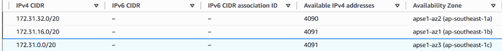
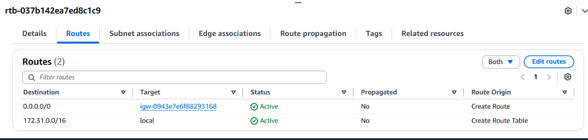
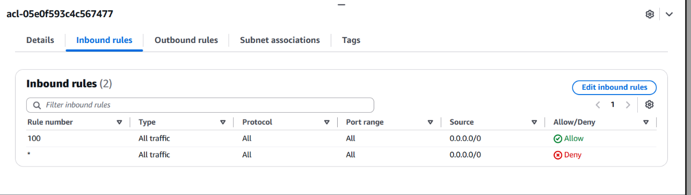
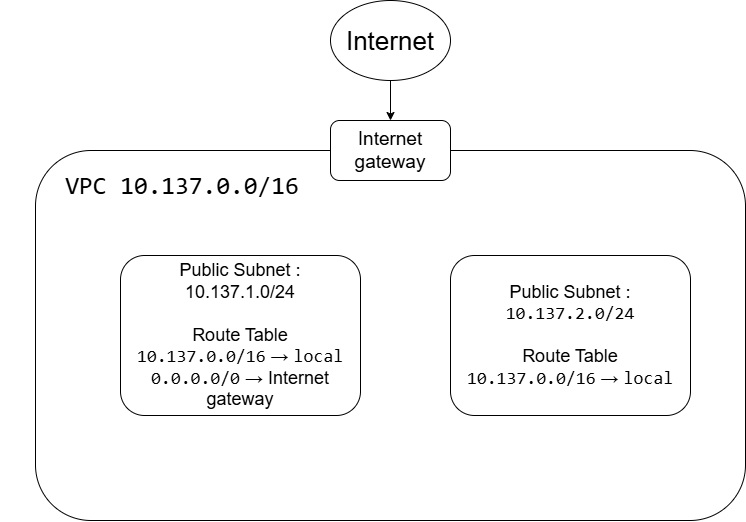

# Assignment 2 Submission

<!--
How to use this template:

1. Copy this file to submissions/assignment-2/<your-github-username>/submission.md
2. Replace every answer placeholder with your own answer. Delete the angle brackets too.
3. Save your four images in the same folder, with the exact file names below.
4. Do not write your full name or your student number in this file.
-->

## About me

- GitHub username: Sdjada
- Section: IV-ACSAD
- IAM user name that I signed in with: <answer>
- X: 137

---

## Part A. Explore

### A1. The VPC

Default VPC IPv4 CIDR:

172.31.0.0/16

Number of addresses in that CIDR:

65,536

### A2. The subnets

|     Availability Zone       |    IPv4 CIDR   |
|-----------------------------|----------------|
| apse1-az2 (ap-southeast-1a) | 172.31.32.0/20 |
| apse1-az1 (ap-southeast-1b) | 172.31.16.0/20 |
| apse1-az3 (ap-southeast-1c) | 172.31.0.0/20  |

Screenshot 1. Save it as `screenshot-1-subnets.png` in your folder. The image line below shows it.

### A3. Available addresses

Available IPv4 addresses in each subnet:

4090,4091,4091

Why is the number lower than 4,096?

AWS reserves 5 addresses in every subnet, so a /20 shows 4,091 available (4,096 - 5).

What uses the missing address in the subnet with the lowest number?

One subnet has 4,090 available addresses instead of 4,091, so one address is already taken. Something in that subnet, like an EC2 instance or another service, has a network interface that uses up one private IP. The lowest one is subnet-00a120af9f25fdd4d (172.31.32.0/20).
### A4. The route table

|  Destination  |         Target        |
| ------------- | --------------------- |
|   0.0.0.0/0   | igw-0943e7e6f88293168 |
| 172.31.0.0/16 |         local         |

Screenshot 2. Save it as `screenshot-2-routes.png` in your folder. The image line below shows it.

### A5. Public or private

Are the default subnets public or private? Which route proves it?

The default subnets are public. In their route table, 0.0.0.0/0 points to the Internet Gateway igw-0943e7e6f88293168, so anything in them can reach the internet directly. The other route, 172.31.0.0/16 → local, just handles traffic inside the VPC.

### A6. The internet gateway

State of the internet gateway:

attached

What happens to the default subnets if the gateway is detached?

If the Internet Gateway gets detached, the default subnets stop being public. The 0.0.0.0/0 route would have nowhere to go, so nothing inside could reach the internet and nothing outside could reach in. Resources in the VPC could still talk to each other through the local route.

### A7. NAT gateways

Number of NAT gateways:

0

Can a server in a new private subnet download updates? Why?

No. A private subnet has no route to the Internet Gateway, and with no NAT gateway in this VPC, there's nothing to send its internet traffic through.

### A8. The network ACL

| Rule number |    Source   | Allow or Deny |
| ----------- | ----------- | ------------- |
|    100      | 	0.0.0.0/0 |     Allow     |
|     *       | 	0.0.0.0/0 |      Deny     |

How is a network ACL different from a security group?

A network ACL protects a whole subnet, while a security group protects a single resource like an EC2 instance. A network ACL is stateless and can allow or deny, so replies need their own rule. A security group is stateful and only allows, so replies are let through automatically.

Screenshot 3. Save it as `screenshot-3-network-acl.png` in your folder. The image line below shows it.

### A9. The default security group

Inbound rule (type and source):

All Traffick and sg-0c5b6d4081cf0a534

Which resources can send traffic to an instance that uses it?

Only other resources in the same default security group can send traffic to the instance. The rule allows all traffic, but only from the group itself, so everything else, including the internet, is blocked.

---

## Part B. Prepare

### B1. Plan two subnets

- Public subnet CIDR: 10.137.1.0/24
- Private subnet CIDR: 10.137.2.0/24

### B2. Route tables

Route table of the public subnet:

|  Destination  |       Target     |
| ------------- | ---------------- |
| 10.137.0.0/16 |       local      |
|   0.0.0.0/0   | Internet gateway |

Route table of the private subnet:

|  Destination  | Target |
| ------------- | ------ |
| 10.137.0.0/16 | local  |

### B3. My VPC diagram

Tool used (Excalidraw, draw.io, Lucidchart, or paper): 

draw.io

Save your diagram as `vpc-diagram.png` in your folder. The image line below shows it.

### B4. Predict a change

Can you still open the web page from your laptop? Why?

No. Without the `0.0.0.0/0` route to the Internet gateway, traffic from my laptop has no path into the subnet, so the page won't load.

Can the instance still reach another instance in the VPC? Why?

Yes. The `local` route is still there, and it covers everything inside 10.137.0.0/16, so instances in the VPC can still talk to each other.

### B5. Place a database

Which subnet gets the database? Why?

The private subnet. A database doesn't need to be reached from the internet, and with no route to the Internet gateway it's much harder for outsiders to get to it. Only the web server in the public subnet needs to talk to it.

### B6. My question about VPCs

What is your question, and what made you think of it?

If a private subnet has no internet route, how does a server in it get software updates safely? I wondered because the private subnet in my design can't reach the internet at all, and a real server would still need patches.
